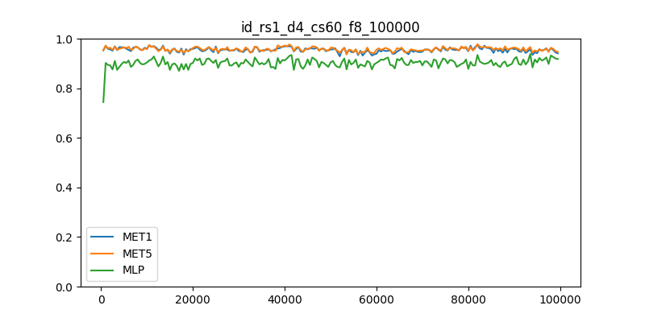

# Classifier selection

## Przydatne łącza

- [https://deslib.readthedocs.io/en/latest/](https://deslib.readthedocs.io/en/latest/)

## Pliki

- `StreamGenerator.py` — prymitywny generator strumieni,
- `DumbDelayPool.py` — przykładowa klasa prymitywnego klasyfikatora strumieniowego,
- `experiment.py` — przykład przetwarzania z wykorzystaniem klasyfikatora *DumbDelayPool*,
- `TestAndTrain.py` — moduł uczący.

## Uwagi

1. Scorer definiowany jest bezpośrednio w klasyfikatorze, tu dla przykładu jako f1_score.
2. Metoda `fit()` klasyfikatora nie wykonuje się w przetwarzaniu ani razu, od początku wykorzystując do uczenia metodę `partial_fit()`. Pozostaje w implementacji tylko dla zaspokojenia minimum niezbędnego, aby scikit-learn traktował go jako poprawny estymator.
3. Do przetwarzania wybrano osiemnaście przykładowych strumieni syntetycznych zawierających problemy binarne o różnej trudności i różnym rodzaju dryfu koncepcji.
4. Każdy ze strumieni ma po sto tysięcy obiektów.

## Przykładowy przebieg

